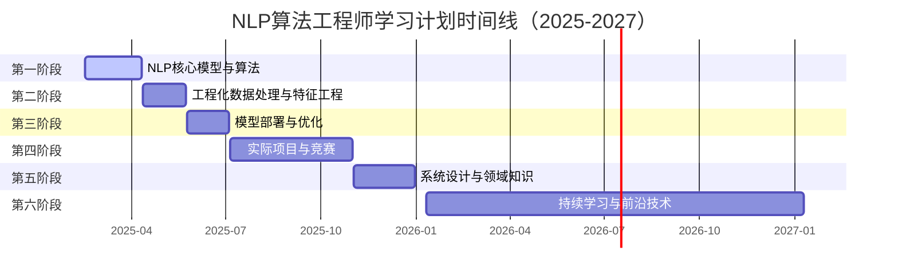

以下是完整的**自然语言处理（NLP）算法工程师学习计划**，涵盖从基础到进阶的所有阶段，结合工程实践与国内求职需求。每个阶段的学习内容、目标、资源与输出成果均已整理，方便您存档与参考。d

---

## **完整学习计划**
### **第一阶段：NLP核心模型与算法（6-8周）**
| **周数** | **学习内容**                                                                 | **具体任务**                                                                 | **输出成果**                                                                 |
|----------|------------------------------------------------------------------------------|------------------------------------------------------------------------------|------------------------------------------------------------------------------|
| 第1周    | NumPy核心操作                                                                | - 学习NumPy数组操作（广播、切片、向量化） - 实现矩阵乘法、注意力机制计算   | - 代码：手动实现Self-Attention中的QKV计算 - 笔记：NumPy与Python原生性能对比|
| 第2周    | PyTorch基础                                                                  | - 学习Tensor操作（自动求导、GPU加速） - 用PyTorch实现简单神经网络（如MLP）| - 代码：手写数字分类任务 - 笔记：Autograd机制与计算图原理                 |
| 第3周    | PyTorch模型构建                                                              | - 学习Module类与模型封装 - 从零实现LSTM/GRU单元（不用`nn.LSTM`）          | - 代码：自定义LSTM单元 - 对比官方实现性能差异                             |
| 第4周    | Transformer底层实现                                                          | - 用PyTorch从零实现Transformer（Encoder层、Multi-Head Attention）            | - 代码：可运行的Transformer模型 - 实验：在小规模翻译任务中验证模型        |
| 第5周    | BERT/GPT底层实现                                                             | - 实现BERT的Masked LM和Next Sentence Prediction - 实现GPT的生成式结构     | - 代码：简化版BERT/GPT - 实验：在文本补全任务中测试模型                   |
| 第6周    | 模型调试与性能优化                                                            | - 学习PyTorch Profiler分析模型性能 - 优化数据加载与GPU内存使用            | - 代码：优化后的BERT微调流程 - 报告：GPU利用率与训练速度对比              |
| 第7周    | 工业级代码规范                                                                | - 学习PyTorch项目结构（Lightning框架） - 编写可复用的数据加载与训练Pipeline| - 代码：模块化NLP训练框架 - 文档：代码注释与API说明                      |
| 第8周    | 项目整合与面试准备                                                            | - 整合前7周代码，构建完整NLP项目（如问答系统） - 准备技术面试常见问题      | - GitHub仓库：结构化项目代码 - 面试题笔记：PyTorch底层原理与模型实现细节  |

---

### **第二阶段：工程化数据处理与特征工程（4-6周）**
| **周数** | **学习内容**                                                                 | **具体任务**                                                                 | **输出成果**                                                                 |
|----------|------------------------------------------------------------------------------|------------------------------------------------------------------------------|------------------------------------------------------------------------------|
| 第1周    | 文本清洗与预处理                                                              | - 学习正则表达式与规则引擎 - 实现多语言文本清洗工具                       | - 代码：文本清洗工具 - 笔记：常见文本噪声处理方法                         |
| 第2周    | 分布式数据处理                                                                | - 学习Spark/Dask基础 - 实现大规模文本数据的分词与向量化                   | - 代码：分布式文本处理Pipeline - 实验：单机vs分布式性能对比               |
| 第3周    | 特征工程与词向量                                                              | - 学习TF-IDF、Word2Vec、FastText - 实现自定义词向量训练                   | - 代码：词向量训练脚本 - 实验：词向量质量评估                            |
| 第4周    | 多语言处理                                                                    | - 学习多语言分词工具（如Jieba、Spacy） - 实现跨语言词向量对齐（MUSE）     | - 代码：多语言分词与词向量对齐工具 - 实验：跨语言文本分类任务             |
| 第5周    | 数据标注与增强                                                                | - 学习数据标注工具（Label Studio） - 实现数据增强（如回译、同义词替换）    | - 代码：数据增强工具 - 实验：增强数据对模型性能的影响                     |
| 第6周    | 项目实战                                                                      | - 完成一个工业级数据处理项目（如新闻分类） - 撰写项目总结与技术博客         | - GitHub仓库：完整数据处理Pipeline - 技术博客：数据处理优化技巧            |

---

### **第三阶段：模型部署与优化（4-6周）**
| **周数** | **学习内容**                                                                 | **具体任务**                                                                 | **输出成果**                                                                 |
|----------|------------------------------------------------------------------------------|------------------------------------------------------------------------------|------------------------------------------------------------------------------|
| 第1周    | 模型压缩                                                                     | - 学习量化、剪枝、蒸馏技术 - 实现BERT模型量化                             | - 代码：量化后的BERT模型 - 实验：量化对性能的影响                         |
| 第2周    | 推理加速                                                                     | - 学习ONNX、TensorRT - 将PyTorch模型转换为ONNX并部署                      | - 代码：ONNX模型部署脚本 - 实验：推理速度对比                             |
| 第3周    | 服务化部署                                                                    | - 学习Flask/FastAPI - 实现NLP模型API服务                                  | - 代码：可部署的API服务 - 实验：API响应时间与并发能力                     |
| 第4周    | 高并发优化                                                                    | - 学习异步任务队列（Celery） - 实现高并发请求处理                         | - 代码：高并发API服务 - 实验：负载测试报告                                |
| 第5周    | 监控与日志                                                                    | - 学习Prometheus/Grafana - 实现模型服务监控                               | - 代码：监控系统集成 - 实验：服务稳定性分析                               |
| 第6周    | 项目实战                                                                      | - 完成一个端到端NLP项目（如智能客服） - 撰写项目总结与技术博客             | - GitHub仓库：完整项目代码 - 技术博客：部署与优化经验分享                  |

---

### **第四阶段：实际项目与竞赛（8-12周）**
| **周数** | **学习内容**                                                                 | **具体任务**                                                                 | **输出成果**                                                                 |
|----------|------------------------------------------------------------------------------|------------------------------------------------------------------------------|------------------------------------------------------------------------------|
| 第1-4周  | 开源项目贡献                                                                  | - 参与Hugging Face/FairSeq等开源项目 - 提交代码或文档贡献                  | - GitHub贡献记录 - 开源社区影响力提升                                     |
| 第5-8周  | Kaggle/NLP竞赛                                                                | - 参加Kaggle NLP竞赛（如文本分类、问答系统） - 优化模型并提交结果          | - Kaggle竞赛排名 - 技术博客：竞赛经验分享                                 |
| 第9-12周 | 工业级场景实战                                                                | - 完成一个工业级NLP项目（如搜索推荐、智能客服） - 撰写项目总结与技术博客    | - GitHub仓库：完整项目代码 - 技术博客：工业级问题解决方案                  |

---

### **第五阶段：系统设计与领域知识（6-8周）**
| **周数** | **学习内容**                                                                 | **具体任务**                                                                 | **输出成果**                                                                 |
|----------|------------------------------------------------------------------------------|------------------------------------------------------------------------------|------------------------------------------------------------------------------|
| 第1-2周  | 高并发系统设计                                                                | - 学习负载均衡、缓存机制 - 设计高并发NLP服务                              | - 系统设计文档 - 实验：高并发性能测试                                     |
| 第3-4周  | 领域适配                                                                     | - 学习医疗、金融等领域文本处理 - 实现领域词典构建与NER任务                | - 代码：领域词典与NER工具 - 实验：领域文本分类任务                        |
| 第5-6周  | 端到端Pipeline设计                                                            | - 设计并实现一个端到端NLP系统（如智能客服） - 撰写项目总结与技术博客       | - GitHub仓库：完整系统代码 - 技术博客：系统设计经验分享                    |
| 第7-8周  | 面试准备                                                                     | - 刷《百面机器学习》《深度学习500问》 - 模拟面试与漏洞填补                 | - 面试题答案整理 - 模拟面试记录                                           |

---

### **第六阶段：持续学习与前沿技术（长期）**
| **周数** | **学习内容**                                                                 | **具体任务**                                                                 | **输出成果**                                                                 |
|----------|------------------------------------------------------------------------------|------------------------------------------------------------------------------|------------------------------------------------------------------------------|
| 长期     | 论文复现                                                                     | - 复现ACL/EMNLP顶会论文 - 撰写技术博客                                    | - GitHub仓库：复现代码 - 技术博客：论文解读与复现经验                     |
| 长期     | 多模态融合                                                                   | - 学习文本+图像/语音融合技术 - 实现多模态任务（如图文生成）                | - 代码：多模态模型实现 - 实验：多模态任务性能评估                         |
| 长期     | 大模型微调                                                                   | - 学习LLaMA、ChatGLM等大模型微调技术 - 实现领域适配微调                   | - 代码：微调后的模型 - 实验：微调效果对比                                 |

---

### **学习资源推荐**
1. **课程**  
   - 斯坦福CS224N（深度学习与NLP）：[课程链接](https://web.stanford.edu/class/cs224n/)  
   - Hugging Face NLP课程：[课程链接](https://huggingface.co/course/chapter1)

2. **书籍**  
   - 《Speech and Language Processing》（Daniel Jurafsky）  
   - 《Deep Learning with PyTorch》（Eli Stevens等）

3. **工具与框架**  
   - Hugging Face Transformers库：[官网](https://huggingface.co/transformers/)  
   - PyTorch官方文档：[官网](https://pytorch.org/docs/stable/index.html)  
   - Optuna调参工具：[官网](https://optuna.org/)

---

通过此计划，您将系统掌握NLP算法工程师所需的核心技能，并具备工业级项目经验，适应国内高竞争求职环境。

